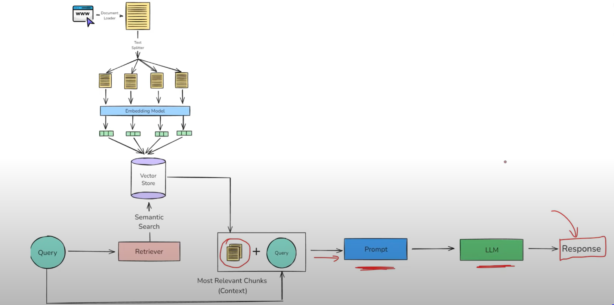

Sometimes, we may need to give LLMs some external resources, or want to limit our LLM to use only some specific domain/text(like question answering chatbot for business) for this we can just finetune the model with our dataset. 
But there are some problems with finetuning technique
1. You need to have large dataset and compute resources
2. You will require technical expertise
3. We need to finetune everytime when our dataset is updated(problem when dataset is continuously getting updates)

Alternatives to finetuning:
## 1. **`In context Learning`**
 It is a core capability of Large Language Models (LLMs) like GPT-3/4, Claude, and Llama, where the model learns to solve a task purely by seeing examples in the prompt-without updating its weights.   
An **emergent property** of a system is a behaviour or ability that suddenly appears in a system when it reaches a certain scale or complexity-even though it was not explicitly programmed or expected from the individual components.
## 2. **`RAG`** 
Along with the user query a relevant context is also passed to model as prompt, and then LLM finds answer from prompt and it's own parametric knowledge  

RAG based system has 4 main steps: Indexing, retrieval, Augmentation, Generation   
We will look into RAG in more detail
# 1. Indexing 
Indexing is the process of preparing your knowledge base so that it can be efficiently searched at query time. This steps consists of 4 sub-steps.
### 1. Document Ingestion 
You load your source knowledge into memory.  
**Examples:** PDF reports, Word documents, YouTube transcripts, blog pages, GitHub repos, internal wikis, SQL records, scraped webpages  
**Tools:** LangChain loaders (`PyPDFLoader`, `YoutubeLoader`, `WebBaseLoader`, `GitLoader`, etc.)

### 2. Text Chunking
Break large documents into small, semantically meaningful chunks  
**Why chunk?**  
LLMs have context limits (e.g., 4K-32K tokens)
Smaller chunks are more focused better semantic search  
**Tools:** `RecursiveCharacterTextSplitter`, `MarkdownHeaderTextSplitter`, `SemanticChunker` etc.

### 3. Embedding Generation
Convert each chunk into a dense vector (embedding) that captures its meaning.  
**Why embeddings?**  
- Similar ideas land close together in vector space
- Allows fast, fuzzy semantic search  

**Tools:**
`OpenAIEmbeddings`, `SentenceTransformerEmbeddings`, `InstructorEmbeddings` etc

### 4. Storage in a Vector Store
Store the vectors along with the original chunk text + metadata in a
vector database.  
Vector DB options:
- Local: `FAISS`, `Chroma`
- Cloud: `Pinecone`, `Heaviate`, `Milvus`, `Qdrant`

# 2. Retrieval 
Retrieval is the real-time process of finding the most relevant pieces of information from a pre-built index (created during indexing) based on the user's question.

It's like asking:  
`From all the knowledge I have, which 3-5 chunks are most helpful to answer this query?`

# 3.Augmentation 
Augmentation refers to the step where the retrieved documents (chunks of relevant context) are combined with the user's query to form a new, enriched prompt for the LLM.

# 4.Generation 
Generation is the final step where a Large Language Model (LLM) uses the user's query and the retrieved & augmented context to generate a response